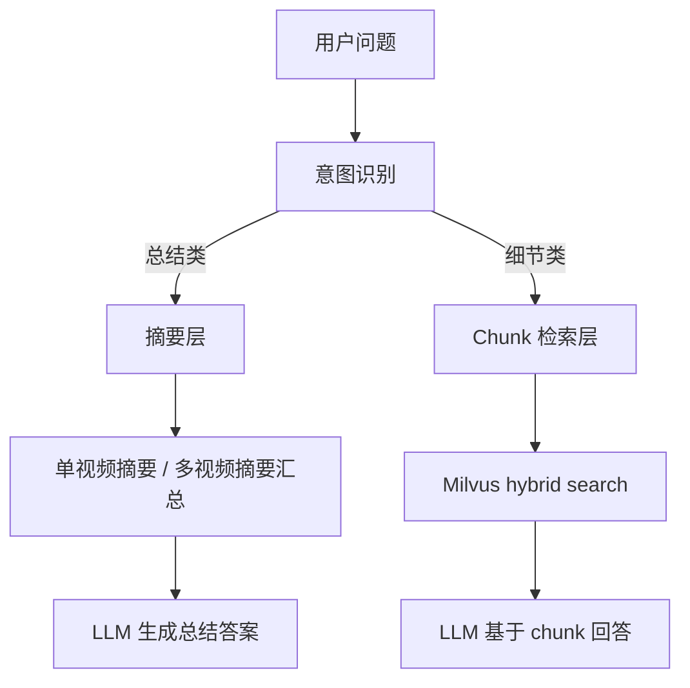
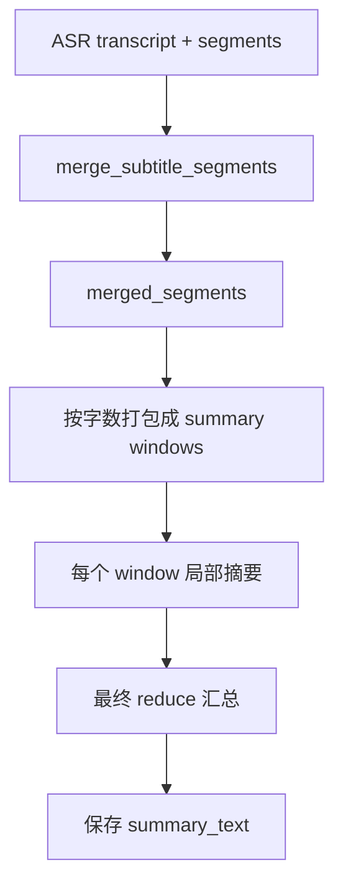

# BiliBrain 总结类问答方案总结报告

**日期**: 2026-03-24  
**状态**: 已完成第一版实现  
**适用对象**: 开发者、后续维护者

## 概述

本文档总结 BiliBrain 中“总结类问题”和“细节类问题”的分流设计、单视频摘要生成方案、多视频总结方案、失败回退策略，以及为什么采用当前实现方式。

当前方案的核心目标只有三个：

- 让“总结一下这个视频/收藏夹”不再依赖 `top-k` chunk 召回。
- 保留现有 chunk 检索链路，继续处理细节问答。
- 控制实现复杂度、调用次数和存储成本，先做最小可用版本。

## 背景与问题

当前系统原本是典型的 chunk 检索问答链路：

```text
query -> 向量/BM25 检索 -> top-k chunk -> LLM 生成答案
```

这个链路适合回答：

- 某个术语是什么意思
- 某句话在哪个视频里提到
- 某个知识点是怎么说的

但它不适合回答：

- 总结一下这个视频
- 总结一下这个收藏夹
- 梳理核心内容和要点

原因很简单：

- `top-k` 优化的是局部相关性，不是全局覆盖率。
- 总结类问题需要尽量覆盖整段视频或多段视频的主要主题。
- 当 query 很泛时，召回结果容易集中在少数局部片段，导致漏掉大量内容。

因此，总结类问题必须和细节类问题分开处理。

## 方案目标

### Goals

- 为每个已处理视频生成一份可复用的 `summary_text`。
- 对总结类问题优先使用摘要层，而不是 chunk 层。
- 支持单视频总结和收藏夹总结。
- 摘要失败不影响视频索引和细节问答。
- 第一版存储和逻辑尽量轻，不引入大量字段和缓存层。

### Non-Goals

- 第一版不做通用 `folder summary` 缓存。
- 第一版不做复杂 LLM 意图分类器。
- 第一版不做主题总结的专门抽取链。
- 第一版不保存中间 `section summaries` 到数据库。

## 整体设计

系统被拆成两层能力：

- `chunk layer`
  负责细节问答、证据定位、片段跳转。
- `summary layer`
  负责全局概括、单视频总结、多视频汇总。

整体路由如下：



## 功能一：任务类型识别

### 目标

先判断用户是在问总结，还是在问细节。

### 第一版实现

第一版使用规则分类，不增加额外 LLM 调用。

分类结果分成三类：

- `video_summary`
- `folder_summary`
- `detail_qa`

### 规则

如果 query 命中以下关键词，视为总结类：

- `总结`
- `概括`
- `归纳`
- `梳理`
- `主要内容`
- `核心内容`
- `核心观点`
- `讲了什么`
- `说了什么`

如果 query 同时命中以下范围词，则视为收藏夹总结：

- `收藏夹`
- `这些视频`
- `文件夹`
- `这一组`
- `这组视频`
- `这一批视频`

如果 query 明显指向当前视频，且前端传入了当前 `bvid`，则视为单视频总结：

- `这个视频`
- `这条视频`
- `这期视频`
- `本视频`
- `当前视频`
- `这期`

其余情况默认走 `detail_qa`。

### 为什么这样实现

- 规则法几乎没有成本和延迟。
- 第一版误判风险可接受，因为误判时可以回退到现有 chunk QA。
- 如果一开始就对每次 query 多加一次 LLM 分类，会增加时延和成本，但收益并不大。

### 当前限制

- 混合问题的识别还不够细。
- `topic_summary` 还没有独立出来。
- 后续如果误判样本增多，再考虑加轻量 LLM 分类器。

## 功能二：单视频摘要生成

### 目标

让每个已索引视频有一份独立的 `summary_text`，作为总结类问题的主输入。

### 摘要起点

摘要不是从原始 ASR chunk 开始，而是从语义合并后的 `merged_segments` 开始。

流程如下：



### 为什么不从原始 ASR chunk 开始

- 原始 ASR chunk 是按音频切的，边界不稳定。
- 存在 overlap，直接摘要容易产生重复。
- `merged_segments` 已经更接近语义段，是更好的摘要输入单元。

### 生成规则

- 当总字数小于等于 `5000` 字时，直接一次性摘要。
- 当总字数大于 `5000` 字时，先按约 `4500` 字切成多个窗口。
- 每个窗口做一次局部摘要。
- 最后对多个局部摘要做一次 reduce，生成最终 `summary_text`。

### 为什么按字数切窗口

- 比“每几个 chunk 一组”更稳定。
- 不同视频语速不同，按 chunk 数切会导致窗口大小波动很大。
- 按字数控制更容易预估 token 成本。

### 数据存储

第一版只新增一张极简表：

`video_summaries`

- `bvid`
- `transcript_hash`
- `summary_text`
- `updated_at`

### 为什么只存一份最终摘要

- 避免存一堆重复 JSON。
- 前端展示、总结问答和后续聚合都只需要最终摘要。
- 中间窗口摘要只是中间产物，没有必要长期落库。

### 为什么加 `transcript_hash`

- 用于判断转写文本是否变化。
- 如果 transcript 没变，就不必重复生成摘要。
- 这是控制成本最有效的手段之一。

## 功能三：总结类问答 Pipeline

### 总体原则

- 总结类问题：摘要层优先
- 细节类问题：chunk 层优先

### 场景一：单视频总结

#### 用户问题示例

- 总结一下这个视频
- 这期主要讲了什么
- 帮我梳理这条视频的核心内容

#### 实现方案

```text
query
-> classify_query_intent = video_summary
-> load current video summary_text
-> LLM 基于 summary_text 生成最终回答
-> 若摘要不存在，则回退到单视频 chunk 检索
```

#### 为什么这样实现

- 单视频总结本质上是全局压缩问题，不是局部检索问题。
- 直接用 `summary_text` 可以避免 `top-k` 漏掉后半段或低相关但重要的内容。
- 如果摘要不存在，再回退到 chunk 层，保证功能不丢。

### 场景二：收藏夹总结

#### 用户问题示例

- 总结一下这个收藏夹
- 这些视频主要都在讲什么
- 归纳一下这个文件夹的主要主题

#### 实现方案

```text
query
-> classify_query_intent = folder_summary
-> load folder 下所有 video summaries
-> 如果摘要数量和总字数不大，直接一次汇总
-> 如果摘要数量较大，先分组 reduce，再总汇总
-> 生成最终回答
```

#### 分组规则

第一版的分组阈值：

- 文档数超过 `12` 或总字符数超过 `16000` 时，进入分组 reduce
- 每组最多 `8` 个摘要，或约 `12000` 字

#### 为什么这样实现

- 多视频总结不应该再从 transcript 或 chunk 开始，成本太高。
- 多视频总结应建立在“单视频摘要”之上。
- 摘要的摘要通常比原始 chunk 汇总更省 token，也更不容易遗漏主题。

### 场景三：细节问答

#### 用户问题示例

- context window 是多少
- 哪个视频提到了 BM25
- 第几分钟讲了 embedding

#### 实现方案

继续复用原链路：

```text
query
-> hybrid_search
-> rerank
-> top-k chunk
-> LLM 生成答案
```

#### 为什么保留原链路

- 细节问答需要精确证据，不需要全局摘要。
- 摘要层会压缩细节，不适合回答精确定位类问题。
- 现有 chunk 检索能力已经能很好覆盖这类场景。

### 场景四：总结类失败回退

#### 实现方案

- 如果总结类路由命中，但没有可用摘要，回退到原有 chunk QA。
- 如果摘要层生成回答失败，也回退到原有 chunk QA。

#### 为什么这样实现

- 保证新能力不会破坏旧能力。
- 总结能力是增强层，不应成为问答的单点故障。

## 摘要生成与索引的关系

### 当前执行顺序

```text
audio -> transcript -> index -> summary
```

### 为什么摘要放在索引之后

- `index` 是主功能，决定视频是否进入可问答状态。
- `summary` 是增强功能，不应该阻塞主流程。
- 如果摘要失败，视频仍然可以通过细节 QA 使用。

### 失败策略

- 摘要生成失败只吞掉异常，不向上抛出。
- 索引状态仍然标记为成功。

### 为什么这样实现

- 避免摘要服务不稳定时拖垮整个视频处理链。
- 先保证“能检索”，再追求“能总结”。

## 前端作用域设计

### 当前实现

前端在问答请求中额外传入当前选中的 `bvid`。

### 为什么要传 `bvid`

- 否则“总结一下这个视频”只能知道用户当前在某个收藏夹里，不知道具体是哪条视频。
- 传入 `bvid` 后，后端才能准确走单视频摘要和单视频回退检索。

### 为什么不把所有问答都限制在 `bvid`

- 如果用户当前选中某个视频，但实际上是在问整个收藏夹的问题，强行限定到该 `bvid` 会把范围缩小错。
- 因此当前实现只在 `video_summary` 场景下用 `bvid` 限定检索范围。

## Token 成本分析

### 单视频摘要

以约 `1w` 中文字为例：

- 直接整篇摘要：1 次调用，最省，但漏点风险更高
- `2 个窗口摘要 + 1 次 reduce`：3 次调用，覆盖更稳

当前方案在效果和成本之间取中间值：

- 短文本单轮摘要
- 较长文本 map-reduce

### 收藏夹总结

当前方案不读取原始 transcript，不读取 chunk，只读取每个视频的 `summary_text`。

因此相比直接对多视频 chunk 做总结：

- 输入更短
- 冗余更少
- 成本更可控

### 为什么第一版不做 `folder summary` 缓存

- 先把单视频摘要和实时汇总链路跑通更重要。
- 收藏夹总结的使用频率和收益还需要观察。
- 一开始就做多层缓存会增加实现复杂度和失效处理成本。

## 为什么不采用其他方案

### 方案一：单纯增大 top-k

不采用的原因：

- 只能增加局部召回量，不能保证全局覆盖。
- 会拉高上下文 token 成本。
- 仍然容易把相似片段召回很多次。

### 方案二：每个 ASR chunk 都即时摘要

不采用的原因：

- 调用次数太多。
- ASR chunk 边界不稳定，摘要重复严重。
- 多轮滚动压缩会累积信息损失。

### 方案三：一开始就存大量 section JSON

不采用的原因：

- 当前需求并不需要那么复杂的结构化存储。
- 会增加表设计、读写和后续迁移成本。
- 第一版只存一份最终摘要即可满足主要场景。

### 方案四：每次 query 都先调用 LLM 做分类

不采用的原因：

- 延迟增加。
- 成本增加。
- 第一版规则法已能覆盖主要场景。

## 当前实现清单

### 已完成

- 单视频摘要表 `video_summaries`
- 基于 `merged_segments` 的摘要生成
- 摘要内容的 hash 去重
- 索引后 best-effort 摘要生成
- 单视频总结类问答
- 收藏夹总结类问答
- 总结类失败回退到 chunk QA
- 前端传入当前 `bvid`

### 未完成

- `folder summary` 缓存
- `topic_summary` 专项路由
- 摘要状态的 UI 展示
- 摘要查看面板
- 面向多轮对话的总结意图强化

## 后续建议

### 优先级高

- 增加“查看当前视频摘要”的接口和前端面板
- 观察真实 query，补充分类关键词
- 记录摘要生成失败日志和耗时

### 优先级中

- 支持“这个收藏夹里关于 X 的总结”
- 为总结类答案增加更稳定的模板
- 根据使用频率决定是否引入 `folder summary` 缓存

### 优先级低

- 将 `topic_summary` 从规则中独立出来
- 为摘要层增加更细的结构化存储
- 引入轻量 LLM 分类器替代纯规则

## 一句话总结

当前方案的本质不是“让检索更大”，而是把总结问题从 chunk 检索链里拆出来，单独做成 `summary-first` 的问答链路。这样可以在不破坏现有细节问答能力的前提下，显著提升视频总结和收藏夹总结的完整性与稳定性。
