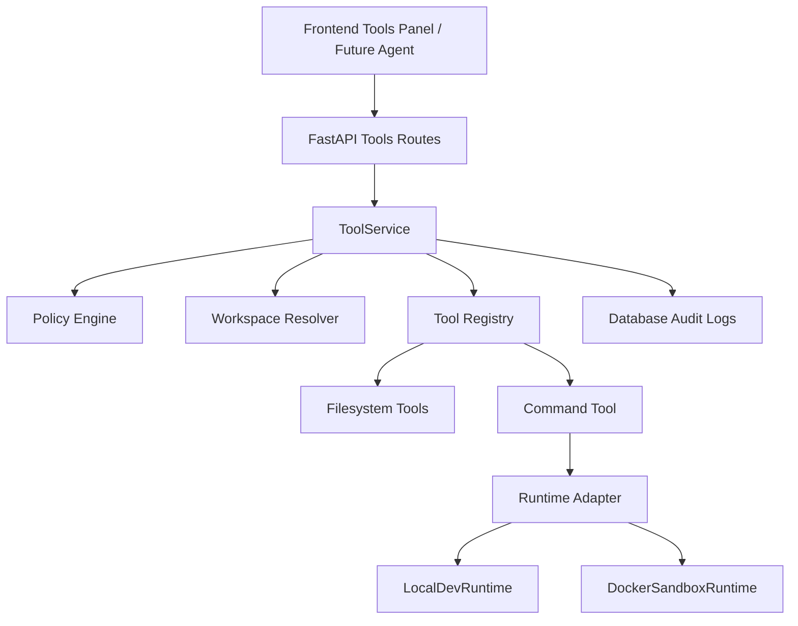
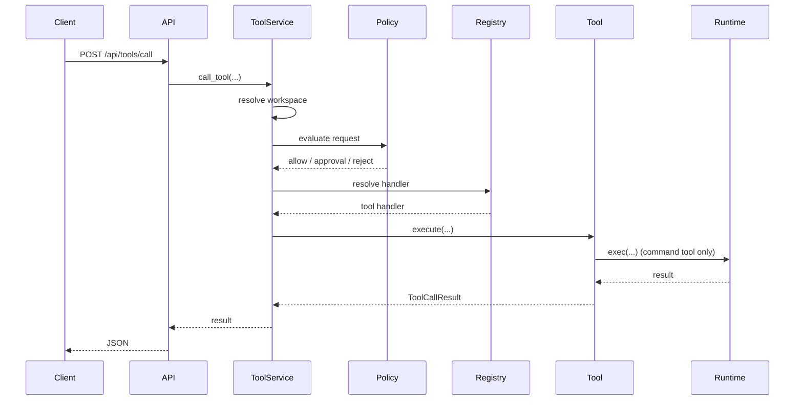

# BiliBrain 工具系统技术说明

**作者**: Codex  
**日期**: 2026-03-26  
**状态**: 当前实现说明

## Overview

本文档说明 BiliBrain 当前已经落地的工具系统实现。目标不是直接把问答链路改造成全工具 Agent，而是先搭建一套可复用、可隔离、可审计的工具执行基础设施，为后续接入 LangGraph Agent、工具规划、审批 UI 和多工具协作提供底座。

当前系统已经支持：

- 工作区隔离 `workspace`
- 文件工具 `list_dir/read_file/write_file/append_file/make_dir`
- 命令执行工具 `run_command`
- 两种 runtime：
  - `local_dev`
  - `docker_sandbox`
- 策略控制：
  - 路径边界
  - 命令前缀限制
  - 写操作审批
  - 命令审批
- FastAPI 工具接口
- LangChain `@tool` 适配层
- 前端手工联调面板

当前系统还没有做：

- 问答主链路中的自动工具调用
- 前端审批流
- Docker 持久会话容器
- `grep/glob/delete/move` 等更完整文件工具
- 浏览器、搜索、邮件工具

---

## Design Goals

### Goals

- 工具调用与现有 RAG 问答链路解耦
- 文件和命令工具都必须受 `workspace` 约束
- 命令执行必须能切换到底层 runtime
- 开发态可快速联调，正式态可切换到容器隔离
- 工具调用结果可记录、可扩展、可接前端

### Non-Goals

- 当前版本不做完整 Agent Planning
- 当前版本不做复杂 ACL / 用户体系
- 当前版本不做交互式 TTY shell
- 当前版本不做 Docker daemon 健康治理和容器回收策略

---

## High-Level Architecture



这个设计的核心思想是：

- `ToolService` 是唯一入口
- `Tool Registry` 决定有哪些工具
- `Policy Engine` 决定能不能执行
- `Runtime Adapter` 决定命令在哪执行
- `workspace` 决定文件和命令的作用域

这和 Claude Code / Codex / deepagents / OpenHands 这类系统的共同思路是一致的：  
不要让模型直接碰宿主机 shell，也不要把权限控制写死在 graph 里，而是先做独立工具运行层。

---

## Package Structure

当前实现位于：

- [`bilibrain/tools/contracts.py`](/D:/AI_Projects/BiliBrain/bilibrain/bilibrain/tools/contracts.py)
- [`bilibrain/tools/errors.py`](/D:/AI_Projects/BiliBrain/bilibrain/bilibrain/tools/errors.py)
- [`bilibrain/tools/workspace.py`](/D:/AI_Projects/BiliBrain/bilibrain/bilibrain/tools/workspace.py)
- [`bilibrain/tools/policy.py`](/D:/AI_Projects/BiliBrain/bilibrain/bilibrain/tools/policy.py)
- [`bilibrain/tools/filesystem.py`](/D:/AI_Projects/BiliBrain/bilibrain/bilibrain/tools/filesystem.py)
- [`bilibrain/tools/command.py`](/D:/AI_Projects/BiliBrain/bilibrain/bilibrain/tools/command.py)
- [`bilibrain/tools/registry.py`](/D:/AI_Projects/BiliBrain/bilibrain/bilibrain/tools/registry.py)
- [`bilibrain/tools/service.py`](/D:/AI_Projects/BiliBrain/bilibrain/bilibrain/tools/service.py)
- [`bilibrain/tools/langchain_tools.py`](/D:/AI_Projects/BiliBrain/bilibrain/bilibrain/tools/langchain_tools.py)
- [`bilibrain/tools/runtime/contracts.py`](/D:/AI_Projects/BiliBrain/bilibrain/bilibrain/tools/runtime/contracts.py)
- [`bilibrain/tools/runtime/local_dev.py`](/D:/AI_Projects/BiliBrain/bilibrain/bilibrain/tools/runtime/local_dev.py)
- [`bilibrain/tools/runtime/docker_models.py`](/D:/AI_Projects/BiliBrain/bilibrain/bilibrain/tools/runtime/docker_models.py)
- [`bilibrain/tools/runtime/docker_sandbox.py`](/D:/AI_Projects/BiliBrain/bilibrain/bilibrain/tools/runtime/docker_sandbox.py)

API 接入位于：

- [`bilibrain/api/routes/tools.py`](/D:/AI_Projects/BiliBrain/bilibrain/bilibrain/api/routes/tools.py)
- [`bilibrain/api/router.py`](/D:/AI_Projects/BiliBrain/bilibrain/bilibrain/api/router.py)
- [`bilibrain/core/runtime.py`](/D:/AI_Projects/BiliBrain/bilibrain/bilibrain/core/runtime.py)

前端联调位于：

- [`frontend/src/views/ToolsStoreView.vue`](/D:/AI_Projects/BiliBrain/frontend/src/views/ToolsStoreView.vue)
- [`frontend/src/components/tools/WorkspaceToolPanel.vue`](/D:/AI_Projects/BiliBrain/frontend/src/components/tools/WorkspaceToolPanel.vue)
- [`frontend/src/components/tools/ToolResultViewer.vue`](/D:/AI_Projects/BiliBrain/frontend/src/components/tools/ToolResultViewer.vue)
- [`frontend/src/services/tools.js`](/D:/AI_Projects/BiliBrain/frontend/src/services/tools.js)

---

## Core Components

### 1. Tool Contracts

文件：[`contracts.py`](/D:/AI_Projects/BiliBrain/bilibrain/bilibrain/tools/contracts.py)

主要定义：

- `ToolCallRequest`
- `ToolCallResult`
- `ToolDefinition`
- `ToolCapability`
- `ToolApprovalMode`
- `ToolWorkspaceCreateRequest`

作用：

- 统一工具请求和响应格式
- 避免 API、ToolService、LangChain wrapper 各自定义一套 schema
- 为后续工具审计、前端展示、Agent 集成提供稳定 contract

当前能力分类：

- `filesystem_read`
- `filesystem_write`
- `command_execute`
- `network_access`
- `external_notify`

目前实际落地的是前三类中的前两类和命令执行。

### 2. Workspace Isolation

文件：[`workspace.py`](/D:/AI_Projects/BiliBrain/bilibrain/bilibrain/tools/workspace.py)

核心职责：

- 为每个工具会话分配 `workspace_id`
- 把工作目录固定在 `TOOLS_WORKSPACE_ROOT/<workspace_id>`
- 阻止 `../` 这类路径逃逸

关键函数：

- `ensure_workspace_exists(...)`
- `normalize_workspace_path(...)`
- `get_workspace_root(...)`
- `create_workspace_session(...)`

当前实现方式：

- 一个 workspace 对应一个目录
- 文件工具只能在这个目录树里活动
- 命令工具的 `cwd` 也必须落在这个目录树内

### 3. Policy Engine

文件：[`policy.py`](/D:/AI_Projects/BiliBrain/bilibrain/bilibrain/tools/policy.py)

当前策略分两类：

- 命令策略
- 写操作审批策略

命令策略：

- 读取允许前缀 `TOOLS_ALLOWED_COMMAND_PREFIXES`
- 读取阻止前缀 `TOOLS_BLOCKED_COMMAND_PREFIXES`
- 默认阻止了：
  - `rm`
  - `shutdown`
  - `reboot`
  - `poweroff`
  - `mkfs`
  - `diskpart`
  - `format`

写操作策略：

- `TOOLS_APPROVAL_REQUIRED_FOR_WRITE=true` 时：
  - `write_file`
  - `append_file`
  - `make_dir`
  默认都需要 `preapproved`

命令策略返回的是 `ToolPolicyDecision`：

- `allowed`
- `requires_approval`
- `reason`

### 4. Tool Registry

文件：[`registry.py`](/D:/AI_Projects/BiliBrain/bilibrain/bilibrain/tools/registry.py)

当前默认注册工具：

- `list_dir`
- `read_file`
- `write_file`
- `append_file`
- `make_dir`
- `run_command`

注册表的作用：

- 给工具定义 metadata
- 标记是否需要 runtime
- 标记默认审批模式

这个设计后续很好扩：

- 加 `search_web`
- 加 `fetch_url`
- 加 `send_email`
- 加 `browser_open`

都只需要往 registry 增加条目，不需要修改 ToolService 主逻辑。

### 5. ToolService

文件：[`service.py`](/D:/AI_Projects/BiliBrain/bilibrain/bilibrain/tools/service.py)

这是整个系统的核心。

职责包括：

- 创建和读取 workspace
- 查找工具定义
- 记录工具调用日志
- 执行策略检查
- 决定是否需要审批
- 调用具体工具实现
- 返回统一结构

调用流程：



当前的重要设计点：

- 文件工具不直接触碰 runtime
- 命令工具一定走 runtime 抽象
- ToolService 不关心 runtime 具体是本地还是 Docker

---

## Filesystem Tools

文件：[`filesystem.py`](/D:/AI_Projects/BiliBrain/bilibrain/bilibrain/tools/filesystem.py)

已实现工具：

- `list_dir_tool`
- `read_file_tool`
- `write_file_tool`
- `append_file_tool`
- `make_dir_tool`

### 路径处理

所有文件工具都会先走 `normalize_workspace_path(...)`。

针对文件型工具，额外增加了 `_ensure_file_target(...)`：

- 禁止空路径
- 禁止 `"."`
- 禁止把目录当文件写

这就是后面修复 `write_file` 报 `Internal Server Error` 的关键。  
之前前端默认 path 是 `"."`，会导致后端尝试对目录执行 `write_text()`，现在会直接返回明确错误：

- `File path must point to a file inside the workspace`

### 审批行为

- `read_file/list_dir`：默认不需要审批
- `write_file/append_file/make_dir`：默认需要 `preapproved`

---

## Command Tool

文件：[`command.py`](/D:/AI_Projects/BiliBrain/bilibrain/bilibrain/tools/command.py)

当前 `run_command_tool(...)` 只做一件事：

- 把命令执行委托给 runtime

其输入参数：

- `command`
- `cwd`
- `timeout_seconds`
- `env`

其输出：

- `exit_code`
- `stdout`
- `stderr`
- `timed_out`
- `duration_ms`

当前没有做：

- 交互式 shell
- session 级 shell state
- 命令流式输出

这符合当前目标：先把“可控执行”做稳，再做高级体验。

---

## Runtime Layer

### 1. LocalDevRuntime

文件：[`local_dev.py`](/D:/AI_Projects/BiliBrain/bilibrain/bilibrain/tools/runtime/local_dev.py)

作用：

- 开发环境快速联调
- 不依赖 Docker

实现方式：

- `subprocess.run(..., shell=True, capture_output=True, timeout=...)`
- `cwd` 仍然受 workspace 约束
- 对 stdout/stderr 做截断

这是开发态 runtime，不适合正式开放给不受限的 Agent。

### 2. DockerSandboxRuntime

文件：

- [`docker_models.py`](/D:/AI_Projects/BiliBrain/bilibrain/bilibrain/tools/runtime/docker_models.py)
- [`docker_sandbox.py`](/D:/AI_Projects/BiliBrain/bilibrain/bilibrain/tools/runtime/docker_sandbox.py)

当前实现方式：

- 每次命令执行一次 `docker run`
- 通过 bind mount 把 workspace 目录挂到容器内
- 命令在容器内执行
- 执行完成容器自动销毁

当前默认安全配置：

- 非 root 用户：`65532:65532`
- 工作目录挂载到 `/workspace`
- `--read-only`
- `--network none`
- 内存限制：`512m`
- CPU 限制：`1.0`
- `--pids-limit 128`
- `--tmpfs /tmp`

容器命令构建逻辑位于：

- `build_docker_run_command(...)`

这种设计的优点：

- 简单
- 易理解
- 无需维护长生命周期容器
- 出问题时容易排查

缺点：

- 每次命令都有容器启动成本
- 不适合未来做高频交互式 shell

### 实际联调结果

当前已经实际验证过：

- Docker daemon 可用
- 通过 `ToolService + DockerSandboxRuntime` 成功执行 `python -V`
- 第一次执行自动拉取了 `python:3.13-alpine`

说明当前 Docker sandbox 这条链路是通的。

---

## API Layer

文件：[`api/routes/tools.py`](/D:/AI_Projects/BiliBrain/bilibrain/bilibrain/api/routes/tools.py)

当前提供的接口：

### `GET /api/tools`

返回：

- tools 是否启用
- 可用工具列表

### `POST /api/tools/workspaces`

创建 workspace。

示例：

```json
{
  "feature_name": "tools",
  "title": "Workspace Sandbox",
  "actor": "workbench"
}
```

### `GET /api/tools/workspaces/{workspace_id}`

读取指定 workspace 的 metadata。

### `POST /api/tools/call`

执行工具。

示例：

```json
{
  "workspace_id": "ws-123",
  "tool_name": "run_command",
  "arguments": {
    "command": "python -V",
    "cwd": ".",
    "timeout_seconds": 30
  },
  "actor": "workbench",
  "approval_mode": "preapproved"
}
```

---

## Error Handling

文件：[`api/errors.py`](/D:/AI_Projects/BiliBrain/bilibrain/bilibrain/api/errors.py)

当前异常处理分两层：

- 明确业务异常：`RuntimeError` 等，转成 JSON
- 最终兜底：`Exception`，也转成 JSON

这样修复了前端曾经遇到的问题：

- `接口没有返回 JSON。响应片段：Internal Server Error`

现在即使后端有意外异常，也会尽量返回：

```json
{
  "detail": "具体错误信息"
}
```

---

## Frontend Integration

当前前端接入位于：

- [`WorkspaceToolPanel.vue`](/D:/AI_Projects/BiliBrain/frontend/src/components/tools/WorkspaceToolPanel.vue)
- [`ToolResultViewer.vue`](/D:/AI_Projects/BiliBrain/frontend/src/components/tools/ToolResultViewer.vue)
- [`services/tools.js`](/D:/AI_Projects/BiliBrain/frontend/src/services/tools.js)

### 当前支持的交互

- 创建 workspace
- 拉取工具列表
- 手工执行工具
- 查看最近一次结果

### 前端默认参数策略

为了减少联调错误，前端切换工具时会自动填默认值：

- `list_dir` -> `path="."`
- `read_file` -> `path="notes.txt"`
- `write_file` -> `path="notes.txt"`
- `append_file` -> `path="notes.txt"`
- `make_dir` -> `path="sandbox/output"`
- `run_command` -> `command="python -V"`

这个逻辑是为了避免把目录 `"."` 当成文件路径去写。

---

## LangChain @tool Integration

文件：[`langchain_tools.py`](/D:/AI_Projects/BiliBrain/bilibrain/bilibrain/tools/langchain_tools.py)

当前已经实现了 `build_langchain_tools(...)`：

- `list_dir`
- `read_file`
- `write_file`
- `append_file`
- `make_dir`
- `run_command`

这层的定位是：

- 不是底层工具实现
- 而是给未来 LangGraph / LangChain Agent 暴露标准 `@tool`

设计原则是：

- `@tool` 只做薄封装
- 真正执行仍然交给 `ToolService`

这样未来：

- 审批
- 审计
- Docker runtime
- workspace 约束

都不需要在 agent 层重复实现。

---

## Database Changes

文件：[`database.py`](/D:/AI_Projects/BiliBrain/bilibrain/bilibrain/db/database.py)

新增表：

### `tool_workspaces`

用于记录：

- `workspace_id`
- `scope_key`
- `feature_name`
- `conversation_id`
- `title`
- `actor`

### `tool_calls`

用于记录：

- `trace_id`
- `workspace_id`
- `tool_name`
- `actor`
- `approval_mode`
- `status`
- `arguments_json`
- `result_json`
- `error_json`
- `duration_ms`

当前 audit 还是基础版，但已经能满足：

- 调试
- 问题回放
- 后续审批流扩展

---

## Configuration

当前工具系统相关配置位于：

- [`.env`](/D:/AI_Projects/BiliBrain/bilibrain/.env)
- [`.env.example`](/D:/AI_Projects/BiliBrain/bilibrain/.env.example)

关键项：

### 基础开关

- `TOOLS_ENABLED`
- `TOOLS_RUNTIME`
- `TOOLS_WORKSPACE_ROOT`

### 输出和审批

- `TOOLS_DEFAULT_TIMEOUT_SECONDS`
- `TOOLS_MAX_STDOUT_BYTES`
- `TOOLS_MAX_STDERR_BYTES`
- `TOOLS_APPROVAL_REQUIRED_FOR_WRITE`
- `TOOLS_APPROVAL_REQUIRED_FOR_COMMAND`

### 命令策略

- `TOOLS_ALLOWED_COMMAND_PREFIXES`
- `TOOLS_BLOCKED_COMMAND_PREFIXES`

### Docker runtime

- `TOOLS_DOCKER_BIN`
- `TOOLS_DOCKER_IMAGE`
- `TOOLS_DOCKER_USER`
- `TOOLS_DOCKER_WORKSPACE_MOUNT_PATH`
- `TOOLS_DOCKER_SHELL`
- `TOOLS_DOCKER_READ_ONLY_ROOTFS`
- `TOOLS_DOCKER_NETWORK_DISABLED`
- `TOOLS_DOCKER_MEMORY_LIMIT_MB`
- `TOOLS_DOCKER_CPU_LIMIT`
- `TOOLS_DOCKER_PIDS_LIMIT`
- `TOOLS_DOCKER_TMPFS_SIZE_MB`

当前本地联调配置已经切到了：

- `TOOLS_ENABLED=true`
- `TOOLS_RUNTIME=docker_sandbox`

注意：

- `.env` 修改后必须重启后端
- 因为 `get_settings()` 有 `lru_cache`
- 且当前 `uvicorn --reload` 不监听 `.env`

---

## Security Considerations

当前已经做的安全控制：

- workspace 路径逃逸防护
- 文件路径和目录路径区分
- 写操作默认审批
- 命令默认审批
- 命令前缀黑名单
- Docker runtime 容器隔离
- 容器默认断网
- 非 root 用户
- 资源限制

当前还没有做的安全控制：

- 前端审批凭证机制
- 用户级权限模型
- 命令参数级审计规则
- 敏感文件名模式检测
- Docker 镜像来源白名单治理

---

## Testing Strategy

当前工具系统相关测试包括：

- `test_tool_contracts.py`
- `test_tool_workspace.py`
- `test_tool_policy.py`
- `test_tool_runtime_local.py`
- `test_tool_runtime_docker_models.py`
- `test_tool_runtime_docker.py`
- `test_filesystem_tools.py`
- `test_command_tool.py`
- `test_tool_service.py`
- `test_tool_routes.py`
- `test_langchain_tools.py`
- `test_tool_service_factory.py`

当前回归结果：

- `16 passed`

这些测试覆盖：

- schema
- 路径隔离
- policy
- local runtime
- docker 命令构建
- 文件工具
- 命令工具
- service dispatch
- API routes
- LangChain `@tool` 包装
- runtime factory 选择

---

## Current Limitations

当前还存在这些限制：

1. 问答主链路还没有自动工具调用
2. `run_command` 还不是流式输出
3. Docker runtime 现在是一命令一容器，不是持久 shell session
4. 没有前端审批 UI
5. 文件工具还没有 `delete/move/copy/glob/grep`
6. 工具日志没有前端历史面板

---

## Recommended Next Steps

### 优先级高

- 把 `ToolCall` 历史和 workspace 状态展示到前端
- 加 `glob_files` 和 `grep_files`
- 给前端加更清晰的审批提示

### 优先级中

- 把 `run_command` 做成 SSE 流式输出
- 引入 session 级 Docker 容器
- 为写操作加入 diff 预览

### 优先级高但要谨慎

- 新增单独的 `tool-capable agent`
- 不要直接污染当前稳定的 RAG QA graph

推荐路线：

- 保持现有 QA 图只做知识问答
- 单独新增 `workspace agent` 模式
- 该模式下才把 `build_langchain_tools(...)` 注入给模型

---

## One-Sentence Summary

当前 BiliBrain 已经落地了一套独立于问答主链路的工具运行基础设施：  
它通过 `ToolService + Workspace + Policy + Runtime Adapter` 这四层，把文件操作和命令执行变成了可隔离、可审计、可扩展的工具系统，并已经支持切换到 Docker sandbox 执行。
